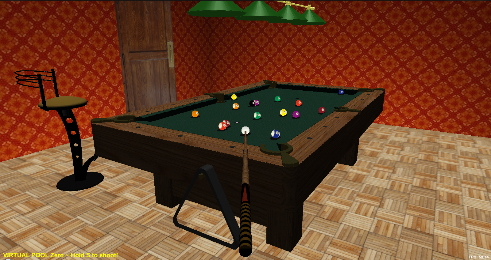

# 3D Billiards Simulator using Java OpenGL #

The project consists in an attempt to replicate the billiards simulation game called [Virtual Pool](http://www.celeris.com/virtual_pool_3_windows.html) ((c) Celeris). So far, the project implements a 3D game environment including a pool table, lamps, chairs, a cue stick and billiard balls. It allows the user to shoot the cue ball and watch the balls collide and fall into pockets. No specific billiard game rules have been implemented yet. User friendly camera controls and cue striking mechanism are identical to the original Virtual Pool.

## Current features: ##
  * Real 3D models loaded from WaveFront format (.obj)
  * Realistic ball physics in collisions and drag force simulation
  * Realistic textures
  * Additional lighting and shadows cast on balls
  * Intuitive camera controls
  * You can actually shoot some pool!

## Features I will one day implement: ##
  * Reflective surfaces on balls – environment mapping
  * Realistic ball texture position with respect to ball movement
  * Bump mapping on floor and table cloth
  * Volumetric lighting coming from the four spotlights
  * Complete ball physics (english, masse, jumping)
  * Actual billiards rules and games + AI for playing against the computer
  * …

## User manual: ##
  * MOVE MOUSE – look around
  * LEFT CLICK & DRAG – zoom in/out
  * HOLD V & MOVE MOUSE – change viewpoint
  * HOLD M & MOVE MOUSE – move cue ball
  * HOLD S & MOVE MOUSE UP-DOWN – strike cue ball
  * HOLD X & MOVE MOUSE – table top overview
  * PRESS A – return to aiming mode
  * PRESS < (Comma) – activate/deactivate sensitivity softening
  * PRESS > (Period) – activate/deactivate sensitivity amplification
  * PRESS Space – pause game
  * PRESS R – reset balls on table
  * PRESS Escape – quit program

## Additional configuration: ##
  * Check [config.properties](Project/config.properties)

## Requirements: ##
  * Uses [OpenGL dll](lib) for Windows x86, which means it requires Windows with Java JRE version for x86 (It will work on Windows x64, but the Java installation must be for x86)

---
exported from https://code.google.com/archive/p/virtual-pool-zero/
